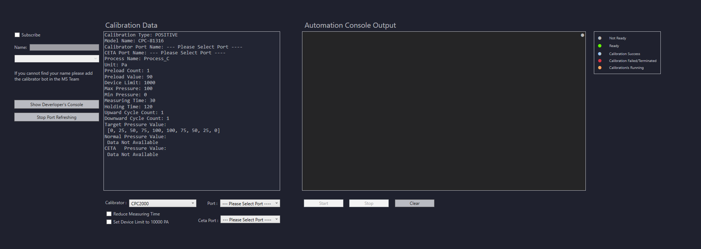

# Calibration Automation Library User Manual

## Introduction
Welcome to the **Calibration Automation Library** User Manual. This library is designed to automate the process of calibration while providing seamless monitoring and interaction through Microsoft Teams. The purpose of this manual is to guide you through the usage, structure, and functionality of the library.

## Installation
The detailed installation guide is available [here](https://github.com/bhoomccpe/Readme-Hub/blob/main/CETA%20Cal%20Implementation%20Readme.md). Follow the steps outlined to set up the library and its dependencies.

## Overview

*Figure 1: The Calibration Window in CETA CAL.*

This is the Calibration window in CETA CAL. To launch the Automation Calibration Window, first select the type of calibration (negative or positive). Then, in the red box, click the **"Calibrate"** button to proceed.

## Calibration Automation Overview

*Figure 2: The Calibration Automation Window.*

This is the Calibration Automation Window. When this window is launched, the software will automatically detect the ports for the CETA Device and Calibrator. To start or stop the automatic detection, the user can click the **"Start/Stop Port Refreshing"** button. This button will toggle its state automatically based on the current action.

The software consists of three main sections:

1. **Calibration Data Section**: Displays relevant calibration information.
2. **Automation Section**: Shows real-time logs and outputs during the calibration process.
3. **Subscription Menu**: Allows users to manage subscriptions related to calibration events.

## Calibration Data Section

*Figure 3: The Calibration Automation Window: Calibration Data.*

This section will show the retrieved data from the CETA CAL Calibration Window. This data will be passed to the automation calibration library during the calibration process. The data will update every time the following selector boxes change: Calibrator, Pot, and CETA Port selectors. Finally, once the calibration is completed without any failures, the data will be updated and passed to the CETA CAL Calibration Page.

## Automation Section

*Figure 4: The Calibration Automation Window: Automation Section.*

From the image above, the Automation Console Output section displays real-time logs and outputs during the calibration process. The circle indicator in the output console represents the current status of the process. This indicator changes color according to the event, and a legend explaining the colors is located beside the console in the top-right corner.

Below the console, there are three buttons:

- **Start:** Initiates the calibration process.
- **Stop:** Stops the calibration process.
- **Clear:** Clears the console output for better readability.

